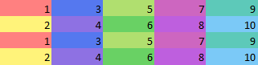

# VBA Golden Ratio
Excel equidistant background coloring using the golden ratio and VBA.



## Usage
To use this file, call the `ColorUniqueCellsUsingGoldenRatio` subroutine with a [`Range`](https://docs.microsoft.com/en-us/office/vba/api/Excel.Range(object)) argument.

```vba
Dim selection As range
Set selection = Application.selection
ColorUniqueCellsUsingGoldenRatio selection ' or: Call ColorUniqueCellsUsingGoldenRatio(selection)
```

## Citations
* https://gamedev.stackexchange.com/questions/46463/how-can-i-find-an-optimum-set-of-colors-for-10-players
* https://stackoverflow.com/questions/3018313/algorithm-to-convert-rgb-to-hsv-and-hsv-to-rgb-in-range-0-255-for-both
* https://www.howtobuildsoftware.com/index.php/how-do/cr3z/vba-ms-access-double-modulus-mod-with-doubles
